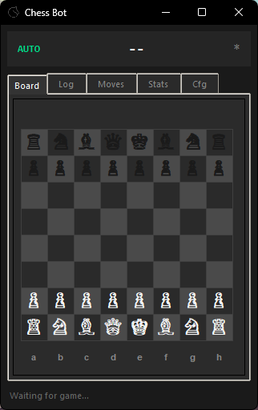
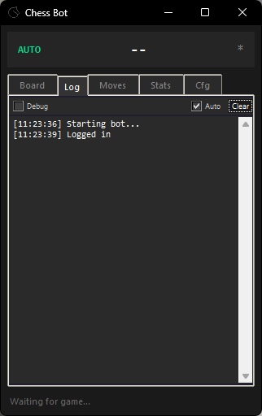
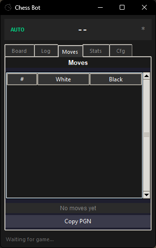
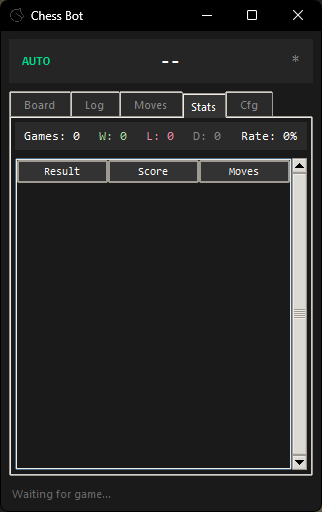
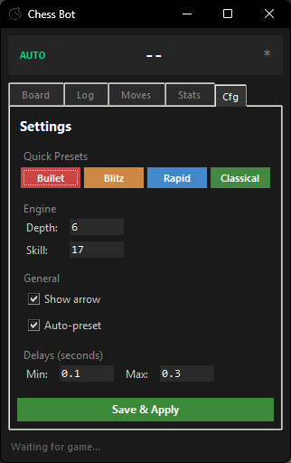

<div align="center">
    <h1>Helping Hand</h1>
    <p>Lichess chess bot with Stockfish integration</p>
    <p>
        
        
        
        
        
    </p>
</div>

## Features

- **Auto-play**: Bot automatically plays moves on Lichess
- **Time control presets**: Auto-detects game speed and adjusts engine settings (bullet/blitz/rapid/classical)
- **Humanization**: Randomized delays to simulate human-like play
- **Live board display**: Shows current position with move suggestions
- **Statistics tracking**: Session and all-time win/loss/draw stats

## Setup

```bash
git clone https://github.com/kWAYTV/helping-hand.git
cd helping-hand
pip install -r requirements.txt
```

**Required in `deps/` folder:**
- [Stockfish](https://stockfishchess.org/download/) → `deps/stockfish/stockfish.exe`
- [GeckoDriver](https://github.com/mozilla/geckodriver/releases) → `deps/geckodriver/geckodriver.exe`
- [xPath Finder](https://addons.mozilla.org/en-US/firefox/addon/xpath_finder/) → `deps/xpath_finder.xpi`

**Auth:** Export Lichess cookies with [Cookie JSON Exporter](https://addons.mozilla.org/en-US/firefox/addon/%E3%82%AF%E3%83%83%E3%82%AD%E3%83%BCjson%E3%83%95%E3%82%A1%E3%82%A4%E3%83%AB%E5%87%BA%E5%8A%9B-for-puppeteer/) → save as `deps/lichess.org.cookies.json`

## Config

Copy `config.example.ini` to `config.ini` and adjust:

| Section | Key | Description |
|---------|-----|-------------|
| `engine` | `path` | Path to Stockfish executable |
| `engine` | `depth` | Search depth (1-30). Higher = stronger but slower |
| `engine` | `skill-level` | Stockfish skill (0-20). Lower = weaker play |
| `general` | `arrow` | Show move suggestion arrow on board |
| `general` | `auto-preset` | Auto-adjust settings based on time control |
| `humanization` | `min-delay` | Minimum delay before moves (seconds) |
| `humanization` | `max-delay` | Maximum delay before moves (seconds) |
| `browser` | `geckodriver-path` | Path to GeckoDriver executable |
| `browser` | `firefox-binary-path` | Path to Firefox |

## Disclaimer

POC for educational purposes. Use at your own risk.
