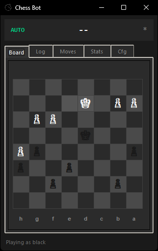

<div align="center">
    <h1>Helping Hand</h1>
    <p>Lichess chess bot with Stockfish integration</p>
    
</div>

## Setup

```bash
git clone https://github.com/kWAYTV/helping-hand.git
cd helping-hand
pip install -r requirements.txt
```

**Required in `deps/` folder:**
- [Stockfish](https://stockfishchess.org/download/)
- [GeckoDriver](https://github.com/mozilla/geckodriver/releases)
- [xPath Finder .xpi](https://addons.mozilla.org/en-US/firefox/addon/xpath_finder/)

**Auth:** Export Lichess cookies with [this extension](https://addons.mozilla.org/en-US/firefox/addon/%E3%82%AF%E3%83%83%E3%82%AD%E3%83%BCjson%E3%83%95%E3%82%A1%E3%82%A4%E3%83%AB%E5%87%BA%E5%8A%9B-for-puppeteer/) → save as `deps/lichess.org.cookies.json`

## Config

```ini
[engine]
depth = 5
skill-level = 14

[general]
auto-play = true
move-key = end
```

## Disclaimer

POC for educational purposes. Use at your own risk.
