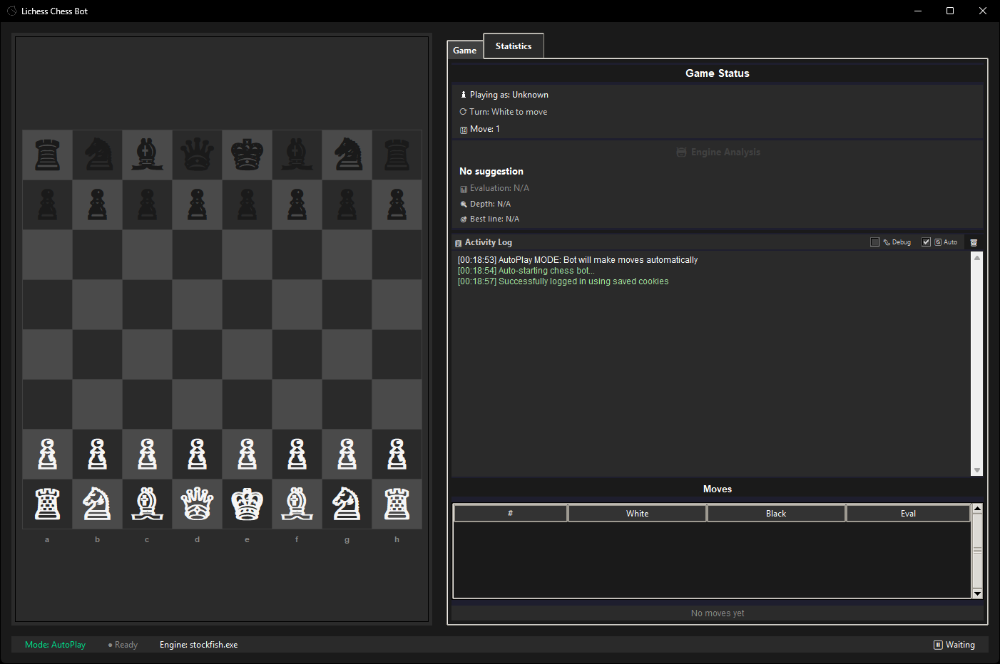

<div align="center">
    <h1>Lichess Chess Bot</h1>
    <h4>Professional automated chess assistant for Lichess.org featuring Stockfish engine integration and advanced humanization algorithms</h4>
    
</div>

## Features

- **Stockfish Integration**: Configurable engine depth and skill levels
- **Modern GUI**: Real-time board visualization with move suggestions
- **Smart Humanization**: Randomized timing patterns to simulate human play
- **Dual Modes**: Fully automated or suggestion-only operation
- **Cross-Platform**: Windows and Linux support

## Installation

### Option 1: Pre-built Release (Recommended)

1. Download from [GitHub Releases](https://github.com/kWAYTV/helping-hand/releases)
2. Extract and configure `config.ini` (see `config.example.ini`)
3. Run the executable

### Option 2: From Source

```bash
git clone https://github.com/kWAYTV/helping-hand.git
cd helping-hand
pip install -r requirements.txt
```

**Dependencies** (place in `deps/` folder):

- [Stockfish Engine](https://stockfishchess.org/download/)
- [GeckoDriver](https://github.com/mozilla/geckodriver/releases)
- [xPath Finder Extension](https://addons.mozilla.org/en-US/firefox/addon/xpath_finder/) (.xpi file)

## Configuration

Essential `config.ini` settings:

```ini
[lichess]
username = your_username
password = your_password
totp-secret = your_2fa_secret  # Optional

[engine]
depth = 5          # Analysis depth (1-20)
skill-level = 14   # Engine strength (0-20)

[bot]
auto-play = true   # Auto-execute moves
move-key = end     # Manual trigger key
log-level = INFO   # Logging verbosity
```

## Usage

### AutoPlay Mode

Fully automated gameplay with built-in humanization delays (0.3-3.0s randomization).

### Suggestion Mode

Displays engine recommendations requiring manual confirmation via hotkey or GUI.

### GUI Features

- Live chess board with position tracking
- Engine move suggestions with visual arrows
- Real-time game information and statistics
- Color-coded activity log with auto-scroll
- Manual control panel

## Disclaimer

**This is a proof of concept (POC) for educational and research purposes only.**

The developers assume no responsibility or liability for any consequences arising from the use of this software. Users are solely responsible for:

- Compliance with Lichess Terms of Service
- Any account actions or penalties
- Legal implications in their jurisdiction

Use at your own risk.
